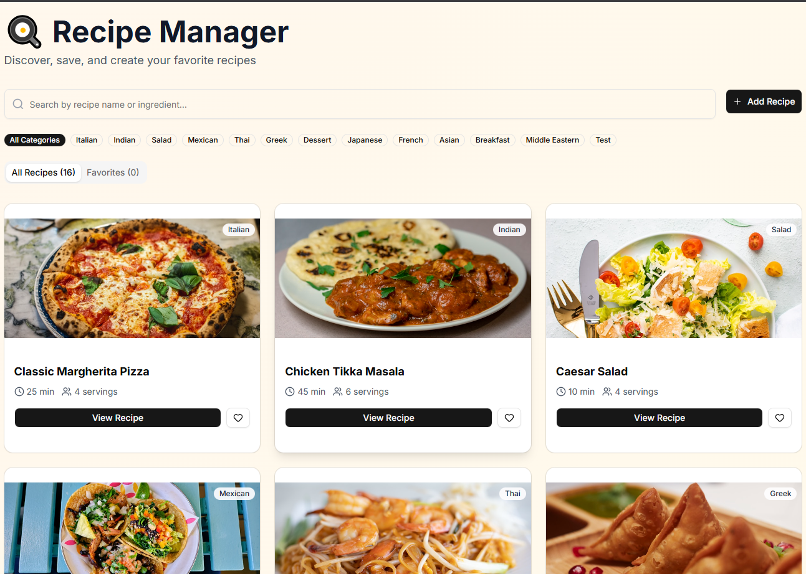

# 🍳 Recipe Manager - RecipeBox

A modern, feature-rich Single-Page Application (SPA) for managing recipes, built with ReactJS and shadcn/ui.



## 📋 Table of Contents

- [Overview](#overview)
- [Features](#features)
- [Tech Stack](#tech-stack)
- [Installation](#installation)
- [Usage](#usage)
- [shadcn/ui Components Used](#shadcnui-components-used)
- [Data Source](#data-source)
- [Project Structure](#project-structure)
- [Features Implementation](#features-implementation)

## 🎯 Overview

Recipe Manager is a comprehensive recipe management application that allows users to:

- Browse through a collection of 15+ pre-loaded recipes
- Search and filter recipes by name, ingredients, or category
- Save favorite recipes for quick access
- Add custom recipes with full details
- Delete custom-added recipes
- View detailed recipe information including ingredients and step-by-step instructions

## ✨ Features

### Core Features

✅ **Recipe Display**

- Grid layout with responsive design (1/2/3 columns based on screen size)
- Recipe cards showing image, title, cooking time, servings, and category
- Hover effects and smooth transitions

✅ **Search Functionality**

- Real-time search with instant filtering
- Search by recipe name or ingredient
- Clear search button for quick reset
- Search icon for better UX

✅ **Favorites System**

- Heart icon to mark/unmark favorites
- Separate "Favorites" tab to view all saved recipes
- Visual indication of favorite status (filled heart)
- Persistent storage using localStorage

✅ **Recipe Management**

- Add custom recipes with complete information
- Form validation to ensure data quality
- Image URL support with fallback to default image
- Delete custom recipes (initial data is protected)
- Confirmation dialog before deletion

✅ **State Management**

- Uses React hooks: `useState`, `useEffect`, `useMemo`
- Proper state management across all components
- localStorage integration for data persistence
- Optimized re-renders using memoization

### Additional Features

🎨 **Enhanced UI/UX**

- Beautiful gradient background
- Category-based filtering with badge UI
- Empty states for no results/favorites
- Loading fallback for broken images
- Responsive design for all screen sizes
- Custom badge for user-added recipes

📱 **Responsive Design**

- Mobile-first approach
- Adapts to different screen sizes
- Optimized touch targets for mobile devices

🎯 **User Experience**

- Intuitive navigation with tabs
- Clear visual feedback for all actions
- Well-organized recipe details modal
- Form validation with error messages
- Smooth animations and transitions

## 🛠 Tech Stack

- **React** 19.2.0 - UI library
- **Vite** 7.2.4 - Build tool and dev server
- **shadcn/ui** - Component library
- **Tailwind CSS** 4.1.17 - Styling
- **Lucide React** - Icons
- **React Router** 7.12.0 - Navigation
- **TanStack React Query** 5.90.19 - State management

## 📦 Installation

### Prerequisites

- Node.js (v18 or higher)
- npm or yarn

### Steps

1. **Clone the repository**

   ```bash
   git clone <your-repository-url>
   cd recipeboxshadcn
   ```

2. **Install dependencies**

   ```bash
   npm install
   ```

3. **shadcn/ui Setup** (Already configured in this project)

   The following shadcn/ui components have been installed:

   ```bash
   npx shadcn@latest init
   npx shadcn@latest add button
   npx shadcn@latest add card
   npx shadcn@latest add dialog
   npx shadcn@latest add input
   npx shadcn@latest add textarea
   npx shadcn@latest add label
   npx shadcn@latest add tabs
   npx shadcn@latest add badge
   npx shadcn@latest add separator
   ```

4. **Run the development server**

   ```bash
   npm run dev
   ```

5. **Open your browser**
   Navigate to `http://localhost:5173` (or the port shown in your terminal)

## 🚀 Usage

### Browsing Recipes

- The main page displays all available recipes in a grid layout
- Click on any recipe card to view full details
- Use the tabs to switch between "All Recipes" and "Favorites"

### Searching for Recipes

- Use the search bar at the top to search by recipe name or ingredient
- Search results update in real-time as you type
- Click the X button to clear the search

### Filtering by Category

- Click on category badges below the search bar
- Filter recipes by Italian, Mexican, Indian, Asian, American, or Dessert
- Click "All Categories" to reset the filter

### Adding to Favorites

- Click the heart icon on any recipe card to add it to favorites
- The heart will fill with red when the recipe is favorited
- Access all favorites from the "Favorites" tab

### Adding Custom Recipes

1. Click the "Add Recipe" button
2. Fill in the form with recipe details:
   - Title (required)
   - Image URL (optional, uses default if empty)
   - Category (optional)
   - Cooking Time in minutes (required)
   - Servings (required)
   - Ingredients (one per line, required)
   - Instructions (one per line, required)
3. Click "Save Recipe" to add it to your collection
4. Custom recipes are marked with a purple "Custom" badge

### Deleting Recipes

- Only custom-added recipes can be deleted
- Click the trash icon on a custom recipe card
- Confirm the deletion in the dialog
- The recipe will be removed from your collection and localStorage

## 🎨 shadcn/ui Components Used

This project utilizes the following shadcn/ui components:

1. **Button** - Used for all interactive actions
   - View recipe, favorite, delete, add recipe buttons
   - Form submit and cancel buttons

2. **Card** - Recipe card layout
   - CardContent for recipe information display

3. **Dialog** - Modal dialogs
   - Recipe detail view
   - Add recipe form
   - DialogHeader, DialogTitle, DialogContent, DialogTrigger, DialogDescription

4. **Input** - Text input fields
   - Search bar
   - Form inputs (title, image URL, cooking time, servings)

5. **Textarea** - Multi-line text input
   - Ingredients list
   - Instructions list

6. **Label** - Form field labels
   - All form inputs have associated labels

7. **Tabs** - Navigation between views
   - TabsList, TabsTrigger, TabsContent
   - "All Recipes" and "Favorites" tabs

8. **Badge** - Category and status indicators
   - Category badges for filtering
   - Category display on recipe cards
   - "Custom" badge for user-added recipes

9. **Separator** - Visual dividers
   - Used in recipe detail dialog

10. **Lucide React Icons**
    - Heart, Clock, Users, Trash2, Plus, Search, X, Tag

## 📊 Data Source

### recipes.json

The application uses a JSON file containing 15 pre-loaded recipes with the following structure:

```json
{
  "recipes": [
    {
      "id": 1,
      "title": "Classic Margherita Pizza",
      "image": "https://...",
      "ingredients": ["ingredient1", "ingredient2"],
      "instructions": ["step1", "step2"],
      "cookingTime": 25,
      "servings": 4,
      "category": "Italian"
    }
  ]
}
```

### Data Persistence

- **Initial recipes**: Loaded from `recipes.json` on app mount
- **Custom recipes**: Stored in localStorage under key `customRecipes`
- **Favorites**: Stored in localStorage under key `favorites`
- Data persists across browser sessions

## 📁 Project Structure

```
recipeboxshadcn/
├── public/                  # Static assets
├── src/
│   ├── assets/             # Images and media files
│   ├── components/         # shadcn/ui components
│   │   └── ui/
│   │       ├── button.tsx
│   │       ├── card.tsx
│   │       ├── dialog.tsx
│   │       ├── input.tsx
│   │       ├── textarea.tsx
│   │       ├── label.tsx
│   │       ├── tabs.tsx
│   │       ├── badge.tsx
│   │       └── separator.tsx
│   ├── data/
│   │   └── recipes.json    # Initial recipe data
│   ├── layout/
│   │   └── Landing.jsx     # Main page component
│   ├── my_components/      # Custom components
│   │   ├── RecipeCard.jsx
│   │   ├── RecipeDialog.jsx
│   │   ├── AddRecipeDialog.jsx
│   │   └── SearchBar.jsx
│   ├── router/
│   │   └── Routing.jsx     # React Router configuration
│   ├── lib/
│   │   └── utils.ts        # Utility functions
│   ├── index.css           # Global styles
│   └── main.jsx            # Application entry point
├── components.json         # shadcn/ui configuration
├── package.json
├── vite.config.ts
├── tailwind.config.js
└── README.md
```

## 🔧 Features Implementation

### State Management (React Hooks)

**useState** - Managing component state:

- `recipes`: Array of all recipes (initial + custom)
- `favorites`: Array of favorited recipes
- `search`: Current search query string
- `selected`: Currently selected recipe for detail view
- `categoryFilter`: Active category filter

**useEffect** - Side effects:

- Load recipes and favorites from localStorage on mount
- Persist favorites to localStorage when they change

**useMemo** - Performance optimization:

- Memoize category list extraction from recipes
- Memoize filtered recipes based on search and category

### Component Architecture

**Landing.jsx** - Main container component

- Manages all application state
- Handles data loading and persistence
- Coordinates child components

**RecipeCard.jsx** - Recipe preview card

- Displays recipe summary
- Handles favorite toggle
- Shows delete button for custom recipes

**RecipeDialog.jsx** - Recipe detail modal

- Shows full recipe information
- Ingredients list
- Step-by-step instructions
- Favorite toggle integration

**AddRecipeDialog.jsx** - Add recipe form

- Form validation
- State management for form fields
- Creates new recipe object
- Resets form after submission

**SearchBar.jsx** - Search input component

- Real-time search functionality
- Clear button when text is present
- Search icon for better UX

### Data Flow

1. **Initial Load**: `recipes.json` → localStorage → state
2. **User Actions**: UI interaction → state update → localStorage
3. **Rendering**: state → filtered data → UI components

### localStorage Schema

```javascript
// Custom Recipes
localStorage.customRecipes = [
  {
    id: "uuid",
    title: "Recipe Title",
    image: "url",
    ingredients: ["ingredient1", "ingredient2"],
    instructions: ["step1", "step2"],
    cookingTime: 30,
    servings: 4,
    category: "Custom",
    isCustom: true
  }
]

// Favorites (stores full recipe objects)
localStorage.favorites = [
  { id: 1, title: "...", ... },
  { id: "uuid", title: "...", ... }
]
```

## 🎓 Learning Outcomes

This project demonstrates:

- ✅ React functional components and hooks
- ✅ State management and data flow
- ✅ Component composition and reusability
- ✅ Form handling and validation
- ✅ localStorage for data persistence
- ✅ Responsive design with Tailwind CSS
- ✅ shadcn/ui component integration
- ✅ User experience best practices
- ✅ Clean code organization

## 🤝 Contributing

This is a technical assessment project. For any questions or feedback, please contact the development team.

## 📝 License

This project is created as part of a technical assessment for Syntactics Inc.

## 👨‍💻 Developer

Created for ReactJS Internship Technical Assessment
Syntactics Inc. - 2026

---

**Built with ❤️ using React, Vite, and shadcn/ui**
